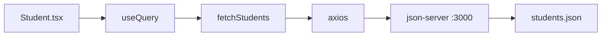

# React Query TanStack Query

A learning project demonstrating data fetching with [TanStack Query](https://tanstack.com/query), axios, and [json-server](https://github.com/typicode/json-server). The app fetches a list of students from a mock REST API and renders them using `useQuery`.

## Tech Stack

- React 19 + TypeScript + Vite
- [@tanstack/react-query](https://tanstack.com/query) — server state management
- [axios](https://axios-http.com/) — HTTP client
- [json-server](https://github.com/typicode/json-server) — mock REST API

## Prerequisites

- Node.js and npm

## Getting Started

Install dependencies, then run the mock API and dev server in **two separate terminals**:

```bash
npm install
```

**Terminal 1 — mock API:**

```bash
npm run api
```

Starts json-server at [http://localhost:3000](http://localhost:3000), watching `students.json` for changes.

**Terminal 2 — frontend:**

```bash
npm run dev
```

Opens the Vite dev server at [http://localhost:5173](http://localhost:5173).

> `json-server` is a local dependency. Use `npm run api` or `npx json-server students.json` — a global install is not required.

## Available Scripts

| Script    | Description                                |
| --------- | ------------------------------------------ |
| `dev`     | Start Vite dev server                      |
| `api`     | Start json-server watching `students.json` |
| `build`   | Type-check and production build            |
| `preview` | Preview production build                   |
| `lint`    | Run ESLint                                 |

## API Endpoints

Provided by json-server from [`students.json`](students.json):

| Method | Endpoint                              | Description       |
| ------ | ------------------------------------- | ----------------- |
| GET    | `http://localhost:3000/students`      | List all students |
| GET    | `http://localhost:3000/students/:id` | Get one student   |

Each student object has the following shape:

```json
{
  "id": 1,
  "name": "John Doe",
  "age": 20,
  "grade": "A",
  "email": "john.doe@example.com"
}
```

## How It Works



1. [`src/main.tsx`](src/main.tsx) wraps the app in `QueryClientProvider`.
2. [`src/components/Student.tsx`](src/components/Student.tsx) calls `useQuery` with `queryKey: ['student']` and a `queryFn` that fetches from the API via axios.
3. On mount, TanStack Query automatically runs the fetch — no manual call needed.
4. Loading and error states are handled before rendering the student list.

## Project Structure

```
├── students.json          # Mock API data
├── src/
│   ├── main.tsx           # QueryClientProvider setup
│   ├── App.tsx            # Renders Student component
│   └── components/
│       └── Student.tsx    # useQuery + student list
```
